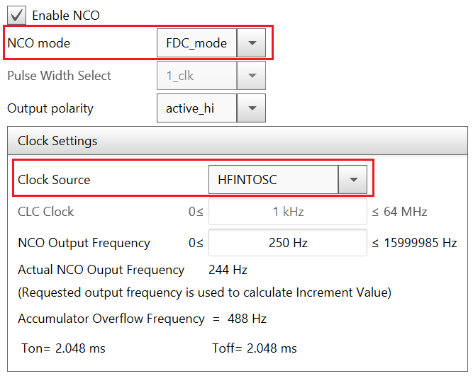
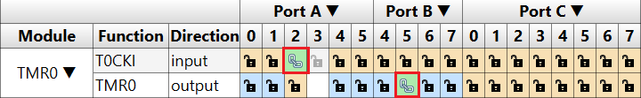
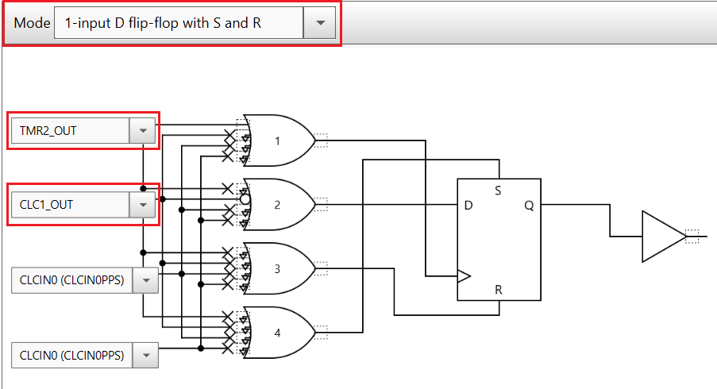
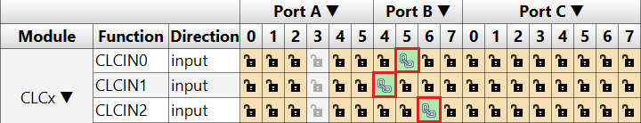

# Driving a Metronome Using a PIC Microcontroller

This repository contains the source code for a metronome application. It was developed using the PIC16F18446 microcontroller, along with a Switec Stepper motor, a potentiometer, a LED and a buzzer.
The implementation of the application consists of a circuit composed of Core Independent Peripherals (CIPs), which is capable to create the signals that drive the Switec Stepper motor as a metronome. It also adjust the number of beats per minute of the metronome by reading an input value, provided by the user.
Due to the usage of CIPs, the driving of the motor is done independently form software, so the computation complexity and program memory space used are substantially reduced.
The source code for initialization of peripherals used in the microcontroller is generated using the MPLAB Code Configurator (MCC).

## Related Documentation
- [AN3380-Driving a Metronome Using a PIC Microcontroller](https://www.microchip.com/wwwappnotes/appnotes.aspx?appnote=en1001742)
- [PIC16F18446 datasheet](http://ww1.microchip.com/downloads/en/DeviceDoc/40001985B.pdf) for more information or specifications.

## Software Used
- MPLAB® X IDE 5.30 or newer [(microchip.com/mplab/mplab-x-ide)](http://www.microchip.com/mplab/mplab-x-ide)
- MPLAB® XC8 2.10 or newer compiler [(microchip.com/mplab/compilers)](http://www.microchip.com/mplab/compilers)
- MPLAB® Code Configurator (MCC) 3.95.0 or newer [(microchip.com/mplab/mplab-code-configurator)](https://www.microchip.com/mplab/mplab-code-configurator)
- PIC16 Library v1.77.0

## Hardware Used
- PIC16F18446 Curiosity Nano [(DM164144)](https://www.microchip.com/DevelopmentTools/ProductDetails/PartNO/DM164144)
- Switec Stepper motor
- Potentiometer
- LED
- Buzzer

## Setup
### MCC Configuration
This section shows the settings of the peripherals used in this example. These settings were done using Microchip Code Configurator (MCC).
The following CIPs were used for this implementation:
- Analog-to-Digital Converter with Computation (ADCC)
- Numerically Controlled Oscillator (NCO)
- Timer2
- Timer0
- Configurable Logic Cell (CLC)
- Peripheral Pin Select (PPS)

#### System Module settings
The MCU uses the high frequency internal oscillator (HFINTOSC), and the clock is set to 32 MHz.

#### ADCC settings
ADCC is used to read the value from the analog potentiometer. It is configured to operate in average mode, with FOSC/ADCLK as clock source and FOSC/32 clock frequency.

The ADCC takes a series of 32 samples and provides the average value as output.

The ADCC uses an external channel (ANA4) which has as correspondent PA4 pin. The signal that comes from the potentiometer is connected to this pin.

#### NCO Settings
The NCO module is used to generate a square wave signal, which will be used as a clock signal for the rest of the peripherals, with the exception of the ADCC and CLC3.
It operates in Fixed Duty Cycle (FDC) mode and has HFINTOSC as clock source.

NCO_out is routed to a pin (PA2), in order to be available for all the peripherals.

#### Timer2 Settings
Timer2 is used to divide the frequency of the NCO output, in order to generate a signal that will represent the input for the CLC1 peripheral. It operates in Roll over pulse mode and has NCO1OUT as clock source.

The division of the NCO1OUT is made by a factor of 3.

#### Timer0 Settings
Timer0 is used to divide the frequency of the NCO output, to obtain a signal whose value indicates the direction of movement for the metronome. It is configured in 8-bit mode and has as input clock source the NCO output.

The input clock source for Timer0 (T0CKI) is routed at the same pin as NCO output (PA2). TMR0 output is routed to PB5 to be available for the CLC3.

#### CLC1 Settings
The CLC1 is configured as a D-FF (1-input D flip-flop with S and R mode), with clock input represented by TMR2 output and with data (D) input represented by CLC1 output inverted.

The CLC1 output is routed to two pins (PC0, PC1) configured as outputs. It will drive one contact of the motor.

#### CLC2 Settings
The CLC2 is also configured as a D-FF (2-input D flip-flop with R), but it contains a multiplexer which selects the signal that will represent
the data (D) input. The clock input is represented by the NCO output.
The multiplexer selects between the CLC1 output and CLC4 output, having the CLC3 output as the selection signal.

The CLC2 output is routed to four pins (PC2, PC3, PC4, PC5) configured as outputs. It will drive two contacts of the motor.

#### CLC4 Settings
The CLC4 is also configured as a D-FF (2-input D flip-flop with R), but it contains a multiplexer which selects the signal that will represent
the data (D) input. The clock input is represented by the NCO output.
The multiplexer selects between the CLC1 output and CLC2 output, having the CLC3 output as the selection signal.

The CLC4 output is routed to two pins (PC6, PC7) configured as outputs. It will drive one contact of the motor.

#### CLC3 Settings
The CLC3 is configured as a 2:1 multiplexer (AND-OR mode). It selects between running as metronome or running in only one direction.

There are two internal signals, named 'Mode' and 'Direction'.
- 'Mode' selects between running as metronome or running in only one direction. It represents the selection input for the multiplexer.
- 'Direction' represents the direction of movement (clockwise/counterclockwise). It represents one data input.
- The other data input is TMR0 output.

They were connected with CLC3 inputs via Peripheral Pin Select (PPS).

The metronome produces an audible and visual signal every time an oscillating period is completed. A buzzer and an LED are used to emit these signals. They were routed to an GPIO pin configured as output (PA5).

## Demo

Note:
- Due to the physical limitations of the Switec Stepper used, the number of beats per minute of the metronome is between 40 and 250.

## Conclusion

This example shows how to develop a metronome application using a PIC16F18446 Curiosity Nano board and few hardware components.
The implementation consists of a circuit based on Core Independent Peripherals (CIPs), which is capable to create the signals that drive the Switec Stepper motor as a metronome.
